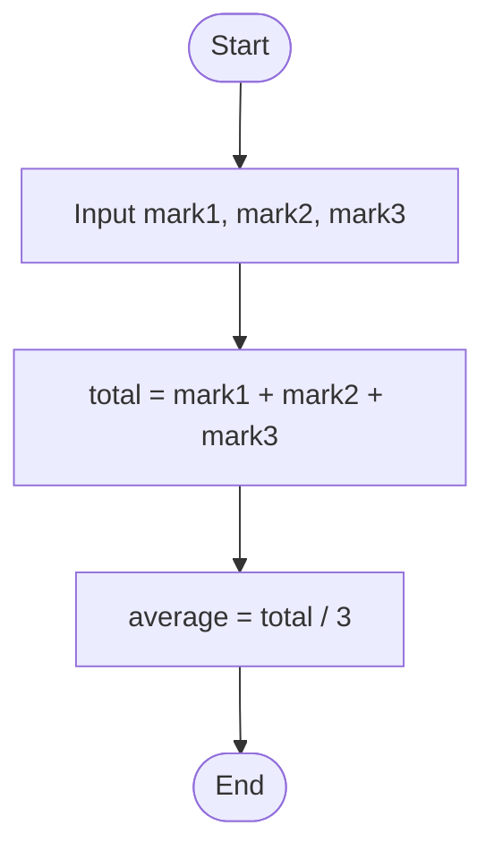

# Workshop: Algorithm and Flowchart

For each question in this workshop, you must complete **two** things:

1.  **Write the pseudocode**
2.  **Draw the flowchart** using either
    - **Option 1:** Draw.io (recommended) → export image → upload to
      your repository → link it in this file
    - **Option 2 (optional):** Write a Mermaid flowchart directly in
      Markdown
    - **Option 3 (optional):** Any other valid method

👉 **IMPORTANT:** At the **bottom of each question**, add the
following sections:

### ✔ Pseudocode

### ✔ Flowchart

---

## 1. Check Even or Odd Number

Design an algorithm and flowchart that take a number as input and
determine whether it is even or odd.

### ✔ Pseudocode

```text
START
    INPUT number
    IF number % 2 == 0 THEN
        PRINT Even
    ELSE
        PRINT Odd
    ENDIF
END
```

### ✔ Flowchart


---

## 2. Calculate Total and Average Marks

Write the algorithm and draw the flowchart for a program that inputs
marks for 3 subjects, calculates the total and average, and displays
both.
```text
START
    INPUT mark1
    INPUT mark2
    INPUT mark3
    total = mark1 + mark2 + mark3
    average = total / 3
END


---

## 3. Display Multiplication Table

Create an algorithm and flowchart that input a number and display its
multiplication table from 1 to 10 using a loop.
```text
    Start
        Declare integer n, integer i
        Prompt "Enter a number:"; read n
        Set i ← 1
        While i ≤ 10 do
        Compute product ← n * i
        Display "n × i = product"
        Increment i ← i + 1
    End
```


---

## 4. Positive, Negative, or Zero Check

Write the algorithm and flowchart to input a number and display whether
it is positive, negative, or zero.

### ✔ Pseudocode

```text
    Start
        Declare integer n
        Prompt “Enter a number:”; read n
        If n > 0, display “Number is positive”
        Else if n < 0, display “Number is negative”
        Else display “Number is zero”
    End

```

### ✔ The Flowchart

 
---

## 5. Simple Interest Calculator

Create an algorithm and flowchart for a program that calculates simple
interest using the formula:

**SI = (P × R × T) / 100**

- **P = Principal** → original amount of money
- **R = Rate of Interest** → percentage per year
- **T = Time** → number of years

### ✔ Pseudocode

```text
Start
    Declare variables P, R, T, SI
    Prompt “Enter principal (P):”; read P
    Prompt “Enter annual rate (R):”; read R
    Prompt “Enter time in years (T):”; read T
    Compute SI ← (P × R × T) / 100
    Display “Simple Interest = SI”
End

```
### ✔ The Flowchart


---

## 6. Average Temperature Calculation

Write the algorithm and draw the flowchart for a program that takes the
temperature of 7 days, finds the average temperature, and displays it.

### ✔ Pseudocode

```text
Start
    Declare array temp[7], integers i, sum, real avg
    Set sum ← 0
    For i from 1 to 7
    Prompt “Enter temperature for day i”; read temp[i]
    Update sum ← sum + temp[i]
    Compute avg ← sum / 7
    Display “Average temperature = avg”
End


```
### ✔ The Flowchart


---

## 7. Calculate Area of a Rectangle

Create an algorithm and flowchart to input length and width, calculate
the area (**Area = Length × Width**), and display the result.


### ✔ Pseudocode

```text
    Start
        Declare variables length, width, area
        Prompt “Enter length:”; read length
        Prompt “Enter width:”; read width
        Compute area ← length × width
        Display “Area = area”
    End


```

### ✔ The Flowchart


---

## 8. Determine Pass or Fail

Write the algorithm and draw the flowchart for a program that takes a
student's average marks and displays **"Pass"** if average ≥ 50,
otherwise **"Fail"**.

### ✔ Pseudocode

```text
    Start
        Input avearage marks
        If average marks >= 50
        Display "Pass"
        Else Display "Fail"
    End

```
### ✔ Flowchart

```mermaid
    flowchart TB
        A ([Start]) --> B [Input Average marks]
        B --> C {Is average marks >= 50?}
        C --YES--> D [Display Pass]
        C --NO--> E [Display Fail]
        D --> F ([End])
        E --> F 
        


```

---

## 9. Calculate Factorial of a Number

Write the algorithm and draw the flowchart that input a number and
calculate its factorial using a loop.

---

## 10. Calculate Discount on Purchase

Write the algorithm and draw the flowchart for a program that inputs the
purchase amount and gives a **10% discount** if the amount is greater
than 1000.

---
