```mermaid
flowchart TD
    A([Start]) --> I[/Get input N/]
    I --> B{N % 2 == 0 ?}
    B -->|Yes| C[/Print Even/]
    B -->|No| D[/Print Odd/]
    C --> E([End])
    D --> E([End])
```

# Workshop: Algorithm and Flowchart

For each question in this workshop, you must complete **two** things:

1.  **Write the pseudocode**
2.  **Draw the flowchart** using either
    - **Option 1:** Draw.io (recommended) → export image → upload to
      your repository → link it in this file
    - **Option 2 (optional):** Write a Mermaid flowchart directly in
      Markdown
    - **Option 3 (optional):** Any other valid method

👉 **IMPORTANT:** At the **bottom of each question**, add the
following sections:

### ✔ Pseudocode

### ✔ Flowchart

---

## 1. Check Even or Odd Number

Design an algorithm and flowchart that take a number as input and
determine whether it is even or odd.

### ✔ Pseudocode

```text
START
    INPUT number
    IF number % 2 == 0 THEN
        PRINT Even
    ELSE
        PRINT Odd
    ENDIF
END
```

### ✔ Flowchart



---

## 2. Calculate Total and Average Marks

Write the algorithm and draw the flowchart for a program that inputs
marks for 3 subjects, calculates the total and average, and displays
both.
```text
START
    INPUT mark1
    INPUT mark2
    INPUT mark3
    total = mark1 + mark2 + mark3
    average = total / 3
END


---

## 3. Display Multiplication Table

Create an algorithm and flowchart that input a number and display its
multiplication table from 1 to 10 using a loop.
```text

<mxfile host="app.diagrams.net" agent="Mozilla/5.0 (Windows NT 10.0; Win64; x64; rv:145.0) Gecko/20100101 Firefox/145.0" version="29.0.3">
  <diagram name="Page-1" id="y8dwtYuGa42qxK41C1vf">
    <mxGraphModel dx="1106" dy="566" grid="1" gridSize="10" guides="1" tooltips="1" connect="1" arrows="1" fold="1" page="1" pageScale="1" pageWidth="850" pageHeight="1100" background="light-dark(#FFFFFF,#FFFFFF)" math="0" shadow="0">
      <root>
        <mxCell id="0" />
        <mxCell id="1" parent="0" />
        <mxCell id="SIEAIUyqUJi9Z-7lkrOS-1" value="Start" style="ellipse;whiteSpace=wrap;html=1;fillColor=#fa6800;fontColor=#000000;strokeColor=#C73500;" vertex="1" parent="1">
          <mxGeometry x="418" width="120" height="80" as="geometry" />
        </mxCell>
        <mxCell id="SIEAIUyqUJi9Z-7lkrOS-11" style="edgeStyle=orthogonalEdgeStyle;rounded=0;orthogonalLoop=1;jettySize=auto;html=1;exitX=0.5;exitY=1;exitDx=0;exitDy=0;" edge="1" parent="1" source="SIEAIUyqUJi9Z-7lkrOS-2">
          <mxGeometry relative="1" as="geometry">
            <mxPoint x="658" y="80" as="targetPoint" />
          </mxGeometry>
        </mxCell>
        <mxCell id="SIEAIUyqUJi9Z-7lkrOS-2" value="Input = n" style="shape=parallelogram;perimeter=parallelogramPerimeter;whiteSpace=wrap;html=1;fixedSize=1;fillColor=#6d8764;fontColor=#ffffff;strokeColor=#3A5431;" vertex="1" parent="1">
          <mxGeometry x="368" y="120" width="220" height="40" as="geometry" />
        </mxCell>
        <mxCell id="SIEAIUyqUJi9Z-7lkrOS-14" style="edgeStyle=orthogonalEdgeStyle;rounded=0;orthogonalLoop=1;jettySize=auto;html=1;exitX=0.75;exitY=1;exitDx=0;exitDy=0;" edge="1" parent="1" source="SIEAIUyqUJi9Z-7lkrOS-3">
          <mxGeometry relative="1" as="geometry">
            <mxPoint x="508" y="230" as="targetPoint" />
          </mxGeometry>
        </mxCell>
        <mxCell id="SIEAIUyqUJi9Z-7lkrOS-3" value="i = 1" style="rounded=0;whiteSpace=wrap;html=1;fillColor=#a0522d;fontColor=#ffffff;strokeColor=#6D1F00;" vertex="1" parent="1">
          <mxGeometry x="428" y="180" width="100" height="40" as="geometry" />
        </mxCell>
        <mxCell id="SIEAIUyqUJi9Z-7lkrOS-35" style="edgeStyle=orthogonalEdgeStyle;rounded=0;orthogonalLoop=1;jettySize=auto;html=1;exitX=0.5;exitY=1;exitDx=0;exitDy=0;strokeColor=light-dark(#000000,#FF8000);entryX=0.5;entryY=0;entryDx=0;entryDy=0;" edge="1" parent="1" source="SIEAIUyqUJi9Z-7lkrOS-4" target="SIEAIUyqUJi9Z-7lkrOS-9">
          <mxGeometry relative="1" as="geometry">
            <mxPoint x="478" y="380" as="targetPoint" />
          </mxGeometry>
        </mxCell>
        <mxCell id="SIEAIUyqUJi9Z-7lkrOS-36" value="NO" style="edgeLabel;html=1;align=center;verticalAlign=middle;resizable=0;points=[];" vertex="1" connectable="0" parent="SIEAIUyqUJi9Z-7lkrOS-35">
          <mxGeometry x="-0.0167" y="-2" relative="1" as="geometry">
            <mxPoint as="offset" />
          </mxGeometry>
        </mxCell>
        <mxCell id="SIEAIUyqUJi9Z-7lkrOS-4" value="While i &amp;lt;= 10 do" style="rhombus;whiteSpace=wrap;html=1;fillColor=#008a00;strokeColor=#005700;fontColor=#ffffff;" vertex="1" parent="1">
          <mxGeometry x="408" y="240" width="140" height="120" as="geometry" />
        </mxCell>
        <mxCell id="SIEAIUyqUJi9Z-7lkrOS-17" style="edgeStyle=orthogonalEdgeStyle;rounded=0;orthogonalLoop=1;jettySize=auto;html=1;" edge="1" parent="1" source="SIEAIUyqUJi9Z-7lkrOS-5">
          <mxGeometry relative="1" as="geometry">
            <mxPoint x="278" y="300" as="targetPoint" />
          </mxGeometry>
        </mxCell>
        <mxCell id="SIEAIUyqUJi9Z-7lkrOS-28" style="edgeStyle=orthogonalEdgeStyle;rounded=0;orthogonalLoop=1;jettySize=auto;html=1;entryX=0.75;entryY=0;entryDx=0;entryDy=0;fillColor=#fa6800;strokeColor=#C73500;strokeWidth=3;" edge="1" parent="1" source="SIEAIUyqUJi9Z-7lkrOS-5" target="SIEAIUyqUJi9Z-7lkrOS-6">
          <mxGeometry relative="1" as="geometry" />
        </mxCell>
        <mxCell id="SIEAIUyqUJi9Z-7lkrOS-5" value="product = n * 1" style="shape=parallelogram;perimeter=parallelogramPerimeter;whiteSpace=wrap;html=1;fixedSize=1;fillColor=#6d8764;fontColor=#ffffff;strokeColor=#3A5431;" vertex="1" parent="1">
          <mxGeometry x="208" y="340" width="120" height="60" as="geometry" />
        </mxCell>
        <mxCell id="SIEAIUyqUJi9Z-7lkrOS-25" style="edgeStyle=orthogonalEdgeStyle;rounded=0;orthogonalLoop=1;jettySize=auto;html=1;entryX=0;entryY=0.75;entryDx=0;entryDy=0;fillColor=#fa6800;strokeColor=#C73500;strokeWidth=3;" edge="1" parent="1" source="SIEAIUyqUJi9Z-7lkrOS-6" target="SIEAIUyqUJi9Z-7lkrOS-8">
          <mxGeometry relative="1" as="geometry">
            <Array as="points">
              <mxPoint x="208" y="540" />
              <mxPoint x="318" y="540" />
            </Array>
          </mxGeometry>
        </mxCell>
        <mxCell id="SIEAIUyqUJi9Z-7lkrOS-6" value="Display: &quot;n * 1 = product&quot;" style="shape=parallelogram;perimeter=parallelogramPerimeter;whiteSpace=wrap;html=1;fixedSize=1;fillColor=#6d8764;fontColor=#ffffff;strokeColor=#3A5431;" vertex="1" parent="1">
          <mxGeometry x="158" y="440" width="120" height="60" as="geometry" />
        </mxCell>
        <mxCell id="SIEAIUyqUJi9Z-7lkrOS-26" style="edgeStyle=orthogonalEdgeStyle;rounded=0;orthogonalLoop=1;jettySize=auto;html=1;fillColor=#fa6800;strokeColor=#C73500;entryX=1;entryY=0.5;entryDx=0;entryDy=0;strokeWidth=3;" edge="1" parent="1" source="SIEAIUyqUJi9Z-7lkrOS-8" target="SIEAIUyqUJi9Z-7lkrOS-4">
          <mxGeometry relative="1" as="geometry">
            <mxPoint x="638" y="300" as="targetPoint" />
            <Array as="points">
              <mxPoint x="638" y="540" />
              <mxPoint x="638" y="300" />
            </Array>
          </mxGeometry>
        </mxCell>
        <mxCell id="SIEAIUyqUJi9Z-7lkrOS-8" value="i = i + 1" style="rounded=0;whiteSpace=wrap;html=1;fillColor=#a0522d;fontColor=#ffffff;strokeColor=#6D1F00;" vertex="1" parent="1">
          <mxGeometry x="318" y="510" width="120" height="60" as="geometry" />
        </mxCell>
        <mxCell id="SIEAIUyqUJi9Z-7lkrOS-9" value="End" style="ellipse;whiteSpace=wrap;html=1;fillColor=#fa6800;fontColor=#000000;strokeColor=#C73500;" vertex="1" parent="1">
          <mxGeometry x="418" y="400" width="120" height="80" as="geometry" />
        </mxCell>
        <mxCell id="SIEAIUyqUJi9Z-7lkrOS-10" value="" style="endArrow=classic;html=1;rounded=0;exitX=0.5;exitY=0;exitDx=0;exitDy=0;fillColor=#fa6800;strokeColor=#C73500;entryX=0.5;entryY=0;entryDx=0;entryDy=0;" edge="1" parent="1" target="SIEAIUyqUJi9Z-7lkrOS-2">
          <mxGeometry width="50" height="50" relative="1" as="geometry">
            <mxPoint x="478" y="80" as="sourcePoint" />
            <mxPoint x="568" y="150" as="targetPoint" />
            <Array as="points">
              <mxPoint x="478" y="110" />
            </Array>
          </mxGeometry>
        </mxCell>
        <mxCell id="SIEAIUyqUJi9Z-7lkrOS-13" value="" style="endArrow=classic;html=1;rounded=0;fillColor=#fa6800;strokeColor=#C73500;entryX=0.5;entryY=0;entryDx=0;entryDy=0;" edge="1" parent="1" target="SIEAIUyqUJi9Z-7lkrOS-3">
          <mxGeometry width="50" height="50" relative="1" as="geometry">
            <mxPoint x="478" y="160" as="sourcePoint" />
            <mxPoint x="458" y="220" as="targetPoint" />
            <Array as="points" />
          </mxGeometry>
        </mxCell>
        <mxCell id="SIEAIUyqUJi9Z-7lkrOS-15" value="" style="endArrow=classic;html=1;rounded=0;fillColor=#fa6800;strokeColor=#C73500;" edge="1" parent="1">
          <mxGeometry width="50" height="50" relative="1" as="geometry">
            <mxPoint x="477.5" y="220" as="sourcePoint" />
            <mxPoint x="478" y="240" as="targetPoint" />
            <Array as="points" />
          </mxGeometry>
        </mxCell>
        <mxCell id="SIEAIUyqUJi9Z-7lkrOS-31" value="" style="endArrow=classic;html=1;rounded=0;exitX=0.5;exitY=0;exitDx=0;exitDy=0;fillColor=#fa6800;strokeColor=#C73500;" edge="1" parent="1" source="SIEAIUyqUJi9Z-7lkrOS-5">
          <mxGeometry relative="1" as="geometry">
            <mxPoint x="308" y="299.5" as="sourcePoint" />
            <mxPoint x="408" y="300" as="targetPoint" />
            <Array as="points">
              <mxPoint x="268" y="300" />
            </Array>
          </mxGeometry>
        </mxCell>
        <mxCell id="SIEAIUyqUJi9Z-7lkrOS-32" value="YES" style="edgeLabel;resizable=0;html=1;;align=center;verticalAlign=middle;" connectable="0" vertex="1" parent="SIEAIUyqUJi9Z-7lkrOS-31">
          <mxGeometry relative="1" as="geometry" />
        </mxCell>
      </root>
    </mxGraphModel>
  </diagram>
</mxfile>

---

## 4. Positive, Negative, or Zero Check

Write the algorithm and flowchart to input a number and display whether
it is positive, negative, or zero.

---

## 5. Simple Interest Calculator

Create an algorithm and flowchart for a program that calculates simple
interest using the formula:

**SI = (P × R × T) / 100**

- **P = Principal** → original amount of money
- **R = Rate of Interest** → percentage per year
- **T = Time** → number of years

---

## 6. Average Temperature Calculation

Write the algorithm and draw the flowchart for a program that takes the
temperature of 7 days, finds the average temperature, and displays it.

---

## 7. Calculate Area of a Rectangle

Create an algorithm and flowchart to input length and width, calculate
the area (**Area = Length × Width**), and display the result.

---

## 8. Determine Pass or Fail

Write the algorithm and draw the flowchart for a program that takes a
student's average marks and displays **"Pass"** if average ≥ 50,
otherwise **"Fail"**.

---

## 9. Calculate Factorial of a Number

Write the algorithm and draw the flowchart that input a number and
calculate its factorial using a loop.

---

## 10. Calculate Discount on Purchase

Write the algorithm and draw the flowchart for a program that inputs the
purchase amount and gives a **10% discount** if the amount is greater
than 1000.

---
